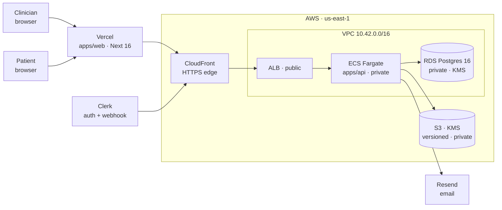

# ClinicSign

> HIPAA-aware document signing for small medical practices.
> A production-shaped vertical slice — real AWS, real auth, real PDFs, real audit trail.

Clinicians upload a PDF, drag signature / date / initial fields onto it, and email it to a patient. The patient signs in a browser — no account, no app, one tap on mobile — and a cryptographically signed PDF lands in both inboxes. Everything in between is observable, tokenized, and locked behind a KMS-encrypted key you control.

---

## Demo

| | |
|---|---|
| Web (Vercel) | `https://<your-vercel-project>.vercel.app` |
| API (CloudFront → ALB → ECS Fargate) | `https://<your-cloudfront>.cloudfront.net` |
| Monorepo | `npm install && npm run dev` |

---

## The architecture in one picture



Only **Vercel, CloudFront, the ALB, and a single NAT** touch the public internet. ECS tasks have no public IP. RDS has no public IP. The signing tokens patients use are 256-bit, hashed at rest, and single-use.

Full deep dive: **[`infra/ARCHITECTURE.md`](./infra/ARCHITECTURE.md)**.

---

## What's inside

```
clinicsign/
├── apps/
│   ├── web/         Next.js 16 · React 19 · Tailwind v4 · shadcn/ui · Clerk     → apps/web/README.md
│   └── api/         Express · Prisma · Zod · Pino · pdf-lib · Clerk · AWS SDK   → apps/api/README.md
├── infra/           Pulumi TypeScript (VPC · RDS · S3 · KMS · IAM · ECR · ECS)
│   ├── ARCHITECTURE.md        what runs where and why (diagrams + tradeoffs)
│   ├── AWS_SETUP_GUIDE.md     account → Pulumi → Vercel → first deploy
│   └── README.md              landing page / table of contents
├── packages/        shared-types, config
├── .cursor/rules/   Cursor rules: TypeScript, Next, API, security, design system
├── PROJECT.md       product spec (personas, flows, schema, HIPAA stance)
└── docker-compose.yml   optional local API container (data is always RDS)
```

Each `apps/*/README.md` is self-contained — you can read either one without having to read the other.

---

## The five things this demo proves

1. **You can reason about a real stack, not just a framework.** VPC perimeters, IAM boundaries, KMS envelope encryption, CloudFront-as-TLS-shim, single-NAT tradeoffs — every one of those decisions is written down somewhere in [`infra/ARCHITECTURE.md`](./infra/ARCHITECTURE.md) with the *why*, not just the *what*.

2. **Patients don't need an account.** The signing token is a 32-byte random string. Raw in the URL, SHA-256 hashed in the DB, 7-day TTL, single-use. That's it. No passwordless-link library, no OAuth, no session. Signature lives entirely in the email.

3. **The PDF pipeline isn't a library call.** On upload, the PDF goes to S3 (KMS-encrypted, versioned). On signing, the API pulls the original, overlays patient field values with pdf-lib, uploads the signed PDF under a different key, and emails presigned download URLs to both parties. Everything is in `apps/api/src/services/`.

4. **The audit log is append-only and in Postgres.** Not a log file, not CloudWatch. `AuditLog` has no `update` or `delete` in the codebase; the model is locked. Every interesting event (`DOCUMENT_SENT`, `DOCUMENT_VIEWED`, `DOCUMENT_SIGNED`, `DOCUMENT_VOIDED`…) writes a row. Display it in the UI, query it from SQL, prove to a regulator who touched what.

5. **The UI takes the patient seriously.** The signing flow runs on a phone (min 280px wide), progress bar, pulsing "Sign here" pill on the next unfilled field, auto-scroll, disabled-until-ready submit, iOS safe-area respected. The clinician flow gets grid-snap + alignment guides, client-side pagination, absolute-local timestamps on every audit row, and a PDF-first two-column detail page. Details in [`apps/web/README.md`](./apps/web/README.md).

---

## Tech stack (at a glance)

| Layer | Choice | Why |
|---|---|---|
| Repo | Turborepo | Shared types (`packages/shared-types`), one-command dev |
| Frontend | Next.js 16 App Router + React 19 + TypeScript strict | App Router maturity, RSC + client splits cleanly |
| UI | Tailwind v4 + shadcn/ui + Radix | Accessible primitives, token-driven design system |
| Forms / state | React Hook Form + Zod + TanStack Query | Same Zod schemas client ↔ server |
| PDF | `react-pdf` (view) + `pdf-lib` (render) | Pure-JS, no native deps, works in Fargate |
| Signature | `signature_pad` | ~5 KB, mobile-friendly, DPR-aware |
| Backend | Node 22 + Express + TypeScript | Boring is correct here |
| Auth | Clerk (clinician) + 256-bit signed tokens (patient) | Free tier covers auth; patients don't need accounts |
| DB | PostgreSQL 16 + Prisma | Typed migrations, real FK constraints |
| Storage | S3 + KMS CMK | HIPAA-eligible, versioned, encrypted |
| Email | Resend | Cleanest DX for transactional; SES wired for prod BAA |
| Logs | Pino (structured JSON) + pino-http | Correlates requests end-to-end |
| Infra | Pulumi TypeScript | Imperative is easier to reason about than HCL for a 700-line program |
| Deploy | Vercel (web) + ECR → ECS Fargate + ALB + CloudFront (API) | HTTPS without buying a domain |

---

## Quick start (monorepo)

```bash
git clone <your-repo-url> && cd clinicsign
npm install
cp .env.example .env                          # fill in (Clerk, Resend, AWS)
cp apps/web/.env.example apps/web/.env.local

# database: Pulumi must have been run first — see infra/AWS_SETUP_GUIDE.md
npm run db:migrate

npm run dev                                   # web on :3000, api on :4000
```

You can also run the API container on its own: `npm run docker:api`. There's no local Postgres service — `DATABASE_URL` always points at RDS. That's intentional.

---

## Running the app against AWS

The shortest path is described in **[`infra/AWS_SETUP_GUIDE.md`](./infra/AWS_SETUP_GUIDE.md)** — account setup, `pulumi up`, Docker → ECR, Vercel env. After it's standing:

- `apiBaseUrl` (CloudFront HTTPS URL) → Vercel's `NEXT_PUBLIC_API_URL`
- `apiBaseUrl/api/webhooks/clerk` → Clerk dashboard webhook endpoint
- `databaseUrl`, `s3BucketName`, AWS creds → repo-root `.env`

Teardown:

```bash
cd infra && AWS_PROFILE=clinicsign pulumi destroy
```

---

## Repo stats

| | |
|---|---|
| Commits on `master` | 60+ |
| TypeScript LOC (app + infra) | ~9,300 |
| Cursor rules | 12 files under `.cursor/rules/` |
| Prisma models | 6 (User, Clinic, Document, DocumentField, DocumentRecipient, AuditLog) |
| Audit event types | 10 |
| Patient signing flow dependencies | `react-pdf`, `signature_pad` — nothing else |

---

## HIPAA stance (read before demoing)

The architecture targets HIPAA-eligible services and controls. **The deployment is not HIPAA-certified** because certification requires BAAs (with AWS and Clerk), SOC 2, breach procedures, and operational training — organizational work this demo deliberately omits. Details in [`PROJECT.md`](./PROJECT.md) and [`infra/ARCHITECTURE.md`](./infra/ARCHITECTURE.md).

Technical controls present today:

- PHI encrypted at rest (S3 + RDS) under a **customer-managed KMS key** with rotation enabled
- PHI encrypted in transit (TLS 1.2+ end-to-end; `sslmode=require` to RDS)
- Append-only audit log with IP + user agent + timestamp on every patient action
- Single-use, time-boxed, SHA-256-hashed signing tokens
- Least-privilege IAM (ECS task role scoped to just S3/KMS/SES on this stack's resources)
- Private subnets for all compute and data; single public ingress (CloudFront → ALB)
- Rate limiting on auth + signing endpoints
- Zod validation at every API boundary; no `any` in strict-mode TypeScript

---

## Further reading

| Doc | When to read it |
|---|---|
| [`apps/web/README.md`](./apps/web/README.md) | You're touching frontend code, design tokens, or the signing flow |
| [`apps/api/README.md`](./apps/api/README.md) | You're adding a route, changing the schema, debugging S3/PDF logic |
| [`infra/ARCHITECTURE.md`](./infra/ARCHITECTURE.md) | You want to understand *why* the stack is shaped this way |
| [`infra/AWS_SETUP_GUIDE.md`](./infra/AWS_SETUP_GUIDE.md) | You want to deploy from zero |
| [`PROJECT.md`](./PROJECT.md) | Product spec, personas, schema, HIPAA notes |
| [`apps/web/DESIGN_SYSTEM.md`](./apps/web/DESIGN_SYSTEM.md) | Color/typography/spacing tokens |

---

## License

Private / take-home use unless you add a license.
