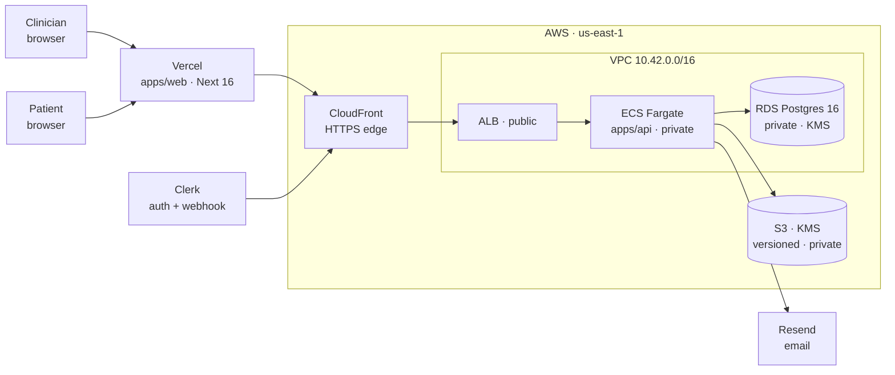

# ClinicSign

> **Heads up:** this was built as a demo, so there are architecture shortcomings I'm aware of and consciously deferred — synchronous PDF rendering, in-memory rate limiting, inline task-definition secrets, no metrics/traces yet, among others. It's a work in progress, and the roadmap for hardening it is tracked in [`docs/BACKEND_IMPROVEMENT_PLAN.md`](./docs/BACKEND_IMPROVEMENT_PLAN.md).

HIPAA-aware document signing for small medical practices. Real AWS, real auth, real PDFs, real audit trail.

Clinicians upload a PDF, drag signature / date / initial fields onto it, and email it to a patient. The patient signs in a browser — no account, no app, one tap on mobile — and a signed PDF lands in both inboxes. Everything in between is observable, tokenized, and encrypted under a customer-managed KMS key.

---

## Where it runs

| Component | URL |
|---|---|
| Web | Vercel (`apps/web`, Next.js 16) |
| API | AWS CloudFront → ALB → ECS Fargate (`apps/api`, Express + Prisma) |

---

## The architecture in one picture



Only **Vercel, CloudFront, the ALB, and a single NAT** touch the public internet. ECS tasks have no public IP. RDS has no public IP. The signing tokens patients use are 256-bit, hashed at rest, and single-use.

Full deep dive: **[`infra/ARCHITECTURE.md`](./infra/ARCHITECTURE.md)**.

---

## What's inside

```
clinicsign/
├── apps/
│   ├── web/         Next.js 16 · React 19 · Tailwind v4 · shadcn/ui · Clerk     → apps/web/README.md
│   └── api/         Express · Prisma · Zod · Pino · pdf-lib · Clerk · AWS SDK   → apps/api/README.md
├── infra/           Pulumi TypeScript (VPC · RDS · S3 · KMS · IAM · ECR · ECS)
│   ├── ARCHITECTURE.md        what runs where and why (diagrams + tradeoffs)
│   ├── AWS_SETUP_GUIDE.md     account → Pulumi → Vercel → first deploy
│   └── README.md              landing page / table of contents
├── packages/        shared-types, config
├── .cursor/rules/   Cursor rules: TypeScript, Next, API, security, design system
├── PROJECT.md       product spec (personas, flows, schema, HIPAA stance)
└── docker-compose.yml   optional local API container (data is always RDS)
```

---

## What's notable

- **No account for the patient.** The signing link carries a 32-byte random token — raw in the URL, SHA-256-hashed in the DB, single-use, 7-day TTL. No passwordless-link library, no OAuth, no session.
- **PDF pipeline is first-class.** Upload writes to S3 (KMS-encrypted, versioned). Signing pulls the original, overlays patient values with `pdf-lib`, writes the signed PDF under a different key prefix, and emails presigned download URLs to both parties. Pure JS — no native deps, runs in Fargate as-is. See `apps/api/src/services/`.
- **Audit log is append-only, in Postgres.** Not a log file, not CloudWatch. `AuditLog` has no `update`/`delete` call sites in the codebase; every interesting event (`DOCUMENT_SENT`, `DOCUMENT_VIEWED`, `DOCUMENT_SIGNED`, `DOCUMENT_VOIDED`, …) is a row you can display in the UI or query from SQL.
- **Private by default.** ECS tasks and RDS have no public IP. The only things on the public internet are Vercel, CloudFront, the ALB, and a NAT Gateway for egress. RDS uses `sslmode=require` even though the path is private.
- **The patient flow works on a phone.** Progress bar, pulsing "next field" pill, auto-scroll to the next required field, disabled-until-ready submit, iOS safe-area respected, field overlays percentage-positioned relative to the PDF canvas so they track the page at any width. Details in [`apps/web/README.md`](./apps/web/README.md).

---

## Tech stack (at a glance)

| Layer | Choice | Why |
|---|---|---|
| Repo | Turborepo | Shared types (`packages/shared-types`), one-command dev |
| Frontend | Next.js 16 App Router + React 19 + TypeScript strict | App Router maturity, RSC + client splits cleanly |
| UI | Tailwind v4 + shadcn/ui + Radix | Accessible primitives, token-driven design system |
| Forms / state | React Hook Form + Zod + TanStack Query | Same Zod schemas client ↔ server |
| PDF | `react-pdf` (view) + `pdf-lib` (render) | Pure-JS, no native deps, works in Fargate |
| Signature | `signature_pad` | ~5 KB, mobile-friendly, DPR-aware |
| Backend | Node 22 + Express + TypeScript | Small surface, boring, well-understood |
| Auth | Clerk (clinician) + 256-bit signed tokens (patient) | Clerk handles clinician auth; patients don't need accounts |
| DB | PostgreSQL 16 + Prisma | Typed migrations, real FK constraints |
| Storage | S3 + KMS CMK | HIPAA-eligible, versioned, encrypted |
| Email | Resend | Good transactional DX; SES is wired for the BAA path |
| Logs | Pino (structured JSON) + pino-http | Correlates requests end-to-end |
| Infra | Pulumi TypeScript | Same language as the app; easier to reason about than HCL for this size |
| Deploy | Vercel (web) + ECR → ECS Fargate + ALB + CloudFront (API) | HTTPS without buying a domain |

---

## Quick start (monorepo)

```bash
git clone <your-repo-url> && cd clinicsign
npm install
cp .env.example .env                          # fill in (Clerk, Resend, AWS)
cp apps/web/.env.example apps/web/.env.local

# database: Pulumi must have been run first — see infra/AWS_SETUP_GUIDE.md
npm run db:migrate

npm run dev                                   # web on :3000, api on :4000
```

You can also run the API container on its own: `npm run docker:api`. There's no local Postgres service — `DATABASE_URL` always points at RDS. That's intentional.

---

## Running the app against AWS

The shortest path is described in **[`infra/AWS_SETUP_GUIDE.md`](./infra/AWS_SETUP_GUIDE.md)** — account setup, `pulumi up`, Docker → ECR → ECS, Vercel env. After it's standing:

- **`npm run deploy:ecs`** (repo root) — rebuild **`linux/amd64`**, push **`:latest`** to ECR, **`force-new-deployment`** on the API service (see **`scripts/deploy-api-ecs.sh`**). Requires AWS CLI credentials (named profile: `export AWS_PROFILE=…`).
- `apiBaseUrl` (CloudFront HTTPS URL) → Vercel's `NEXT_PUBLIC_API_URL`
- `apiBaseUrl/api/webhooks/clerk` → Clerk dashboard webhook endpoint
- `databaseUrl`, `s3BucketName`, AWS creds → repo-root `.env`

Teardown:

```bash
cd infra && pulumi destroy
```

Use the AWS CLI profile from **`aws configure list-profiles`** if required (`export AWS_PROFILE=…`).

---

## Security & HIPAA

The architecture targets HIPAA-eligible services and technical controls. The deployment is **not HIPAA-certified** — certification is an organizational process (BAAs with AWS and Clerk, SOC 2, breach procedures, operational training) that sits on top of the technical work and is out of scope here. Details in [`PROJECT.md`](./PROJECT.md) and [`infra/ARCHITECTURE.md`](./infra/ARCHITECTURE.md).

Technical controls in place today:

- PHI encrypted at rest (S3 + RDS) under a **customer-managed KMS key** with rotation enabled
- PHI encrypted in transit (TLS 1.2+ end-to-end; `sslmode=require` to RDS)
- Append-only audit log with IP + user agent + timestamp on every patient action
- Single-use, time-boxed, SHA-256-hashed signing tokens
- Least-privilege IAM (ECS task role scoped to just S3/KMS/SES on this stack's resources)
- Private subnets for all compute and data; single public ingress (CloudFront → ALB)
- Rate limiting on auth + signing endpoints
- Zod validation at every API boundary; no `any` in strict-mode TypeScript

---

## Further reading

| Doc | When to read it |
|---|---|
| [`apps/web/README.md`](./apps/web/README.md) | You're touching frontend code, design tokens, or the signing flow |
| [`apps/api/README.md`](./apps/api/README.md) | You're adding a route, changing the schema, debugging S3/PDF logic |
| [`infra/ARCHITECTURE.md`](./infra/ARCHITECTURE.md) | You want to understand *why* the stack is shaped this way |
| [`infra/AWS_SETUP_GUIDE.md`](./infra/AWS_SETUP_GUIDE.md) | You want to deploy from zero |
| [`PROJECT.md`](./PROJECT.md) | Product spec, personas, schema, HIPAA notes |
| [`apps/web/DESIGN_SYSTEM.md`](./apps/web/DESIGN_SYSTEM.md) | Color/typography/spacing tokens |

---

## License

All rights reserved.
