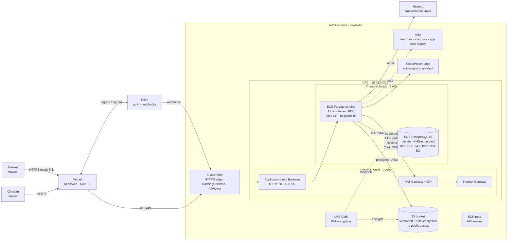

# ClinicSign — infrastructure architecture

Companion to **[`AWS_SETUP_GUIDE.md`](./AWS_SETUP_GUIDE.md)** (the setup walkthrough). This document covers every resource, why it exists, where the trust boundaries are, and what would change for production. Source of truth is **`infra/src/index.ts`**.

---

## 0. TL;DR

- **Frontend** (`apps/web`, Next.js 16) → **Vercel**
- **Backend** (`apps/api`, Node/Express + Prisma) → **AWS ECS Fargate** in private subnets, behind an **ALB** in public subnets, fronted by **CloudFront** for HTTPS termination
- **Data**: **RDS PostgreSQL 16** (private, no public IP) + **S3** (private, KMS-encrypted, versioned). Both encrypt at rest under the same customer-managed **KMS** CMK.
- **Auth**: clinicians use **Clerk**; patients hold a 256-bit signing token (raw in URL, SHA-256 in DB)
- **One Pulumi program** provisions it all. State lives in Pulumi Cloud; secrets are encrypted there.

---

## 1. The picture



**The only things listening on the public internet** are Vercel's CDN, CloudFront, the ALB (HTTP :80, but only reachable in practice via CloudFront), and the NAT Gateway (egress only). Everything else (ECS, RDS, S3, KMS) is private or AWS-internal.

---

## 2. What `infra/src/index.ts` provisions

| Layer | Resources |
|---|---|
| **Network** | VPC `10.42.0.0/16`, IGW, NAT Gateway + EIP, 2 public subnets (`10.42.1.0/24`, `10.42.2.0/24`), 2 private subnets (`10.42.21.0/24`, `10.42.22.0/24`), public + private route tables |
| **Edge** | CloudFront distribution (TLS termination, `Managed-CachingDisabled` + `Managed-AllViewer`) → ALB origin |
| **Ingress** | ALB in public subnets, HTTP listener `:80`, target group on container port `:4000`, ALB SG `0.0.0.0/0:80` |
| **Compute** | ECS Fargate cluster, task definition with API container (CloudWatch logs, env injected from Pulumi config), service in private subnets, Task SG (egress only + ingress from ALB SG) |
| **State** | RDS PostgreSQL 16 (private DB subnet group, `publiclyAccessible: false`, KMS storage encryption, RDS SG `5432` from Task SG ± optional `rdsAllowedCidr`) |
| **Storage** | S3 `clinicsign-<stack>-docs-…` (KMS encrypted, versioned, all-public-access blocked, lifecycle rules), KMS CMK + alias for PHI |
| **Identity** | IAM exec role + task role for ECS, IAM app user + access key (legacy path being retired), S3 + SES least-privilege policies |
| **Build** | ECR repository (`clinicsign-<stack>-api`), `scanOnPush: true`, lifecycle keeps last 5 images |
| **Observability** | CloudWatch Log Group `/clinicsign/<stack>/api`, 14-day retention. ALB access logs not enabled (TODO if regulator-facing) |

---

## 3. Stack config the program reads

```ts
const stack            = pulumi.getStack();              // "dev" | "prod" | …
const rdsAllowedCidr   = config.get("rdsAllowedCidr");   // optional break-glass
const apiContainerPort = config.getNumber("apiContainerPort") ?? 4000;
const apiEnv           = config.getObject<...>("apiEnv") ?? {};
const apiEnvSecret     = config.getSecretObject<...>("apiEnvSecret"); // encrypted in state
```

| Pulumi key | Sensitive? | Becomes |
|---|---|---|
| `rdsAllowedCidr` | no | optional `:5432` ingress (laptop break-glass) |
| `apiContainerPort` | no | container port + ALB target port |
| `apiEnv.*` | no | plain env vars in the ECS task definition |
| `apiEnvSecret.*` | **yes** | encrypted in Pulumi state, injected as plain env at task-definition render time (not via Secrets Manager — yet) |

> **Trade-off.** Today secrets sit in the rendered task definition, visible to anyone with `ecs:DescribeTaskDefinition`. The prod path is `containerDefinitions[].secrets` backed by AWS Secrets Manager / SSM. Listed in §11.

---

## 4. The security perimeter (security groups)

There are three SGs and they form a chain. Reading order matters.

1. **`albSg`** — `tcp/80` from `0.0.0.0/0`. The public origin is "supposed to be" CloudFront, but a determined attacker can hit the ALB DNS directly. Listed as a known gap; closing options:
   - lock ALB ingress to the AWS-managed `com.amazonaws.global.cloudfront.origin-facing` prefix list, or
   - put OAC / a custom origin header check in front
2. **`ecsTaskSg`** — ingress on `:4000` only from `albSg`, egress everywhere. ECS tasks are not directly reachable, even inside the VPC, except from the ALB.
3. **`rdsSg`** — *no* baseline ingress. Two ingress rules added separately: `:5432` from `ecsTaskSg`, and `:5432` from the optional `rdsAllowedCidr`.

So the data path is **internet → ALB (open) → ECS (only from ALB) → RDS (only from ECS)**. Each hop tightens, and each is expressed as an SG-to-SG reference, not a CIDR — so subnet renumbering or instance churn doesn't break the rules.

---

## 5. Database — RDS PostgreSQL

```ts
new aws.rds.Instance(..., {
  engine:               "postgres",
  engineVersion:        "16",
  instanceClass:        "db.t4g.micro",
  allocatedStorage:     20,
  storageType:          "gp3",
  storageEncrypted:     true,           // KMS at rest
  password:             dbMasterPassword.result,
  dbSubnetGroupName:    privateDbSubnetGroup.name,
  vpcSecurityGroupIds:  [rdsSg.id],
  publiclyAccessible:   false,
  skipFinalSnapshot:    true,           // demo; flip for prod
  backupRetentionPeriod: 7,
}, {
  replaceOnChanges: ["dbSubnetGroupName", "publiclyAccessible", "identifier"],
});
```

Why each line matters:

- **`engineVersion: "16"`** pinned. Prisma's generated types are tied to a specific PG version; never let RDS auto-upgrade silently.
- **`storageEncrypted: true`** required for HIPAA-eligible storage. Combined with the customer-managed KMS key, every page on disk is encrypted with a key you control.
- **`publiclyAccessible: false`** + private subnet group — the only way to reach the DB is from inside the VPC.
- **`skipFinalSnapshot: true`** is fine for a demo, **dangerous for prod**. Set to `false` and provide `finalSnapshotIdentifier` before going live.
- **`replaceOnChanges`** — Pulumi will recreate the instance when networking shape changes. We hit `InvalidDBSubnetGroupStateFault` trying an in-place subnet group swap; this annotation says "don't bother, just rebuild".

The connection string is reconstructed in code:

```ts
export const databaseUrl = pulumi.secret(
  pulumi.all([dbMasterPassword.result, clinicsignDb.address, clinicsignDb.port])
    .apply(([pw, host, port]) => {
      const encoded = encodeURIComponent(pw);
      return `postgresql://clinicsign:${encoded}@${host}:${port}/clinicsign?sslmode=require`;
    })
);
```

`sslmode=require` forces TLS to RDS even though the path is private. Belt-and-braces: an attacker who somehow got into the VPC still can't sniff cleartext.

---

## 6. Object storage — S3 + KMS

### KMS CMK

```ts
const kmsKey = new aws.kms.Key("clinicsign-phi-key", {
  enableKeyRotation:    true,
  deletionWindowInDays: 7,
});
```

Customer-managed (not the AWS-managed `aws/s3`). Why:

- **Audit visibility**: every encrypt/decrypt shows up in CloudTrail with the `principalArn` of whoever did it. You can prove who touched a PHI byte.
- **Rotation under your control**: yearly key material rotation; data keys re-encrypt lazily.
- **Revocation**: scheduled deletion immediately renders all S3 objects encrypted under the key cryptographically inaccessible — the 7-day window lets you abort.

### The bucket and its hardening

`bucketPrefix` (not `bucket`) avoids the global-namespace collision risk; AWS appends randomness.

| Resource | What it does |
|---|---|
| `BucketPublicAccessBlock` | All four flags `true`. Public ACLs/policies are physically rejected even if a misconfig adds them. |
| `BucketVersioningV2` | Versioning `Enabled`. An accidental `PutObject` to an existing key keeps the prior version recoverable. |
| `BucketServerSideEncryptionConfigurationV2` | Default SSE-KMS using our CMK; `bucketKeyEnabled: true` to cut KMS API call cost. |
| `BucketLifecycleConfigurationV2` | Two rules: delete `drafts/*` after 30 days; transition `clinics/*` to `STANDARD_IA` after 90 days. |
| `BucketCorsConfigurationV2` | `GET` only; `*` origin. Browser fetches presigned URLs for PDF rendering — the URL itself is the auth, CORS just lets the browser see the bytes. |

### Object key layout

```
clinics/<clinicId>/documents/<documentId>/original.pdf
clinics/<clinicId>/documents/<documentId>/signed.pdf
drafts/...                                     (covered by lifecycle)
```

Lifecycle rules and key prefixes are linked: changing one without the other breaks the cleanup story.

---

## 7. IAM — three identities, three jobs

### ECS execution role (`executionRole`)

Used by the **ECS agent** to pull from ECR and write the container's stdout/stderr to CloudWatch Logs. The application code never assumes this role.

### ECS task role (`taskRole`)

What the **application code** runs as. Attached inline policy grants exactly:

```
s3:ListBucket             on the documents bucket
s3:GetObject/PutObject/
  DeleteObject            on documents bucket/*
kms:Encrypt/Decrypt/
  GenerateDataKey/
  ReEncryptFrom/To        on the CMK
ses:SendEmail/SendRawEmail  *  (SES wired but Resend is the active path)
```

What's *not* there: no `s3:PutBucketPolicy`, no `iam:*`, no `rds:*`, no `kms:CreateKey`. The task can do its job and nothing else.

### Legacy IAM user (`appUser`) — to be retired

Carries the same S3 + KMS + SES policies as the task role. Exists because the API today reads `AWS_ACCESS_KEY_ID` / `AWS_SECRET_ACCESS_KEY` out of env. Production fix: drop those two env vars, let the SDK pick up the task role from the ECS metadata endpoint automatically. The infra is already provisioning the role; only the app code change is missing.

---

## 8. Compute — ECS Fargate

### Task definition

```ts
new aws.ecs.TaskDefinition(..., {
  cpu:    "512",   // 0.5 vCPU
  memory: "1024",  // 1 GiB
  networkMode: "awsvpc",
  requiresCompatibilities: ["FARGATE"],
  executionRoleArn: executionRole.arn,
  taskRoleArn:      taskRole.arn,
  containerDefinitions: pulumi.all([apiImageUri, logGroup.name, apiEnv, apiEnvSecret])
    .apply(([image, lg, env, envSecret]) => JSON.stringify([{
      name: "api",
      image,
      command: [
        "sh", "-c",
        "cd apps/api && ../../node_modules/.bin/prisma migrate deploy && node dist/server.js",
      ],
      portMappings: [{ containerPort: 4000, protocol: "tcp" }],
      environment: [...],
      logConfiguration: { logDriver: "awslogs", options: { ... } },
    }])),
});
```

Three things worth understanding:

1. **`networkMode: "awsvpc"`** — each task gets its own ENI in the private subnet. That's how the ECS task SG can be scoped to a single network interface, not a shared host.
2. **`prisma migrate deploy` runs before the server**, every time. Idempotent (only applies *new* migration files), so schema is always at HEAD without a separate CI step. Trade-off: the first task in a deploy carries the migration latency; subsequent tasks no-op.
3. **No container-level health check.** The container's own health check competes with the ALB's, and ECS would kill the task before the ALB had a chance to mark it healthy. The single source of truth for "is this task ok" is the ALB target group.

### ALB + target group

- `targetType: "ip"` — required when ECS uses `awsvpc` (each task is an IP, not an instance)
- Health check: `GET /health` (returns `{ status: "ok" }`, touches no DB or S3 on purpose). A healthy task is one that can serve HTTP, regardless of dependency state.
- HTTP `:80` only — TLS terminates at CloudFront. The ALB is reachable on plaintext HTTP, which is acceptable because the SG is supposed to restrict it to CloudFront. See "known gap" in §4.

### Service

```ts
new aws.ecs.Service(..., {
  desiredCount:   1,
  launchType:     "FARGATE",
  networkConfiguration: {
    assignPublicIp: false,
    subnets:        [privateSubnet0.id, privateSubnet1.id],
    securityGroups: [ecsTaskSg.id],
  },
  loadBalancers: [{ targetGroupArn, containerName: "api", containerPort: 4000 }],
}, { dependsOn: [listener], ignoreChanges: ["desiredCount"] });
```

`ignoreChanges: ["desiredCount"]` so manual scaling via `aws ecs update-service` (or autoscaling, eventually) doesn't get reverted on the next `pulumi up`.

---

## 9. Edge — CloudFront

```ts
new aws.cloudfront.Distribution(..., {
  origins: [{
    originId: "alb-origin",
    domainName: alb.dnsName,
    customOriginConfig: { httpPort: 80, originProtocolPolicy: "http-only" },
  }],
  defaultCacheBehavior: {
    viewerProtocolPolicy:  "redirect-to-https",
    allowedMethods:        ["GET","HEAD","OPTIONS","PUT","PATCH","POST","DELETE"],
    cachePolicyId:         <Managed-CachingDisabled>.id,
    originRequestPolicyId: <Managed-AllViewer>.id,
  },
  viewerCertificate: { cloudfrontDefaultCertificate: true },
  priceClass: "PriceClass_100",
});
```

Why CloudFront for an API:

- **Free TLS** with the default `*.cloudfront.net` cert. No ACM, no Route 53, no domain. Vercel + Clerk just need an HTTPS URL.
- `Managed-CachingDisabled` + `Managed-AllViewer`: CloudFront passes every header, query param and cookie through; no caching. We're using CloudFront purely as a TLS shim, not a cache.
- `viewerProtocolPolicy: "redirect-to-https"` — clients that hit `http://` get a 301.
- `priceClass: "PriceClass_100"` — North America + Europe edges only (cheapest). Change to `_All` for global.

`originProtocolPolicy: "http-only"` is fine because traffic CloudFront → ALB stays on AWS's network, but for a regulated workload you'd put a self-signed cert on the ALB and switch to `https-only`.

---

## 10. Trust boundary cheat sheet

| Boundary | Crosses what | Auth | Confidentiality |
|---|---|---|---|
| Browser → Vercel | public internet | none / Clerk session cookie | TLS (Vercel cert) |
| Browser → CloudFront → ALB → ECS | public internet | for `/api/*`: Clerk JWT (provider) **or** raw signing token (patient); for `/api/webhooks/clerk`: Svix HMAC | TLS to CF; HTTP CF→ALB on AWS network |
| ECS → RDS | private VPC | Postgres user+pw via `DATABASE_URL` | TLS (`sslmode=require`) |
| ECS → S3 / KMS | AWS network | IAM (legacy access key today, task role tomorrow) | TLS (S3 endpoint) |
| ECS → Resend / Clerk JWKS | NAT egress → public internet | API key / public JWKS | TLS |
| Patient browser → S3 (presigned URL) | public internet | URL-bound HMAC, 5-min TTL (signing view) or 7-day TTL (post-sign download in email) | TLS |

---

## 11. What I'd change for prod

Listed in priority order. Each is a small PR.

1. **Drop the IAM user, use the task role.** Remove `AWS_ACCESS_KEY_ID` / `AWS_SECRET_ACCESS_KEY` from `env.ts` and the `S3Client` constructor; the SDK picks up the task role from the ECS metadata endpoint automatically. Then delete `appUser` / `appAccessKey` from `infra/src/index.ts`.
2. **Restrict ALB ingress.** Replace the `0.0.0.0/0` SG rule with the AWS-managed `com.amazonaws.global.cloudfront.origin-facing` prefix list, or attach an OAC.
3. **HTTPS to the ALB** (`http-only` → `https-only`), with a self-signed cert if you don't want to buy a domain.
4. **Multi-AZ NAT and ECS `desiredCount ≥ 2`.** Costs ~2× NAT and ~2× task compute. Buys true AZ failure tolerance.
5. **Secrets via Secrets Manager.** Switch `containerDefinitions[].environment` entries that contain real secrets to `containerDefinitions[].secrets`, pointing at `arn:aws:secretsmanager:...`. Removes plaintext from the task definition.
6. **RDS hardening.** `deletionProtection: true`, `skipFinalSnapshot: false`, `backupRetentionPeriod: 30`, `performanceInsightsEnabled: true`.
7. **VPC endpoints** for S3, ECR, CloudWatch Logs, Secrets Manager. Cuts NAT egress (and thus cost) and removes the public-internet hop for service traffic.
8. **WAF** (managed rule set) in front of CloudFront.
9. **CloudTrail** to a separate, write-only S3 bucket — required for any HIPAA story.

None of these change application code; they're all in `infra/src/index.ts`.

---

## 12. Cost shape (rough, dev stack)

| Line item | ~$/mo at idle |
|---|---|
| NAT Gateway (always-on) | $32 |
| RDS db.t4g.micro single-AZ | $15 |
| ALB | $16 + per-request |
| ECS Fargate (1 task, 0.5 vCPU / 1 GiB, 24/7) | $13 |
| CloudFront | < $1 |
| S3 + KMS | < $1 |
| ECR | < $1 |
| CloudWatch Logs (14d) | < $1 |
| **Total** | **~$80** |

NAT is the biggest single line item. VPC endpoints for S3/ECR/CloudWatch Logs cut it materially in production; for a dev stack, `pulumi destroy` when you're not using it.

---

## 13. The end-to-end deploy lifecycle

From the **repo root**, with Docker running and AWS CLI credentials (`AWS_PROFILE` optional):

```bash
AWS_PROFILE=clinicsign npm run deploy:ecs
```

That runs [`scripts/deploy-api-ecs.sh`](../scripts/deploy-api-ecs.sh): reads **`ecrRepositoryUrl`** and **`awsRegion`** from the active Pulumi stack, logs in to ECR, builds **`linux/amd64`**, pushes **`:latest`**, then **`aws ecs update-service --force-new-deployment`** on **`clinicsign-<stack>-api`**.

Equivalent manual steps:

```bash
# 1) Build for x86 (Fargate is amd64; mac default is arm64)
docker buildx build --platform linux/amd64 \
  -t "$ECR_URL:latest" \
  -f apps/api/Dockerfile . --push

# 2) Roll the API tasks (migrations run inside the container)
aws ecs update-service \
  --cluster clinicsign-dev \
  --service clinicsign-dev-api \
  --force-new-deployment

# 3) Frontend ships independently via Vercel git push
git push origin master
```

What happens when ECS picks up the new image:

1. ECS pulls the new image from ECR (uses execution role)
2. Container starts → `prisma migrate deploy` runs → `node dist/server.js`
3. ALB target group health check polls `/health` until two 200s in a row → marks new target healthy → drains old
4. Old task gets `SIGTERM` → `server.ts` catches it → closes the HTTP server cleanly, then `prisma.$disconnect()`, then `exit(0)`

### Failure modes actually hit in this repo

- **Wrong image arch** (`docker build` on M-series Mac without `--platform linux/amd64`) → ECS task fails to pull, prints `manifest does not contain descriptor matching platform 'linux/amd64'`
- **Missing env var** → container starts, `env.ts` Zod parse fails, process exits 1, ECS keeps restarting it. CloudWatch shows `Invalid environment configuration`
- **`DATABASE_URL` got dropped** during a `pulumi config` sanitize → same as above, just the DB-shaped instance of it
- **Health check too aggressive** (container `HEALTHCHECK` competing with ALB) → tasks flap. We removed the container-level healthcheck; see §8

---

## 14. Auto-generated Pulumi resource graph

For when you want a visual sanity check that this doc and the code haven't drifted:

```bash
cd infra
pulumi stack graph docs/stack.dot
dot -Tsvg docs/stack.dot -o docs/stack.svg          # scalable
dot -Tpng -Gdpi=160 docs/stack.dot -o docs/stack.png # raster
```

Requires Graphviz: `brew install graphviz`.

---

## 15. Outputs (`pulumi stack output --show-secrets`)

| Output | Meaning |
|---|---|
| `s3BucketName`, `s3BucketArn` | the documents bucket |
| `kmsKeyArn`, `kmsKeyAlias` | the PHI CMK |
| `iamUserName`, `iamAccessKeyId`, `iamSecretAccessKey` (secret) | legacy app user creds |
| `awsRegion`, `ecrRepositoryUrl` | for `docker push` |
| `rdsHost`, `rdsPort`, `databaseUrl` (secret) | DB conn string |
| `vpcId` | for any future cross-stack VPC consumers |
| `albDnsName` | the raw `*.elb.amazonaws.com` (debugging only) |
| `cloudFrontDomainName`, `apiBaseUrl` | the URL Vercel and Clerk point at |

---

## Related docs

- **[`AWS_SETUP_GUIDE.md`](./AWS_SETUP_GUIDE.md)** — AWS account setup, Pulumi bootstrap, Vercel + ECS wiring, end-to-end first deploy
- **[`README.md`](./README.md)** — landing index for this folder
- **[`../PROJECT.md`](../PROJECT.md)** — product spec, schema, HIPAA-relevant technical notes
