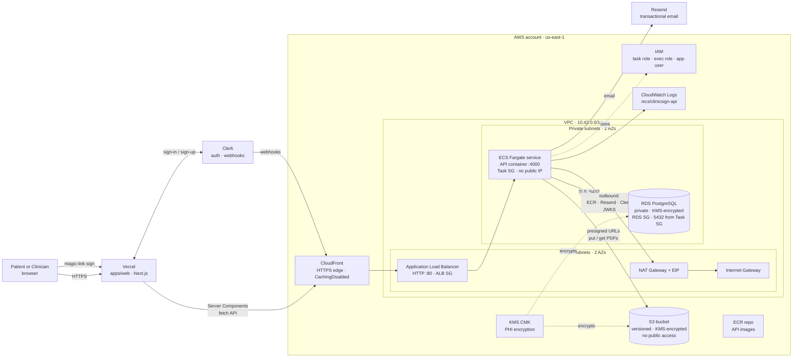

# ClinicSign — infrastructure reference

**Canonical setup:** [`README.md`](./README.md) · **Account + deploy path:** [`AWS_SETUP_GUIDE.md`](./AWS_SETUP_GUIDE.md).

This note captures the **production shape** of the stack as it exists in `infra/src/index.ts` today, with both a hand-drawn high-level diagram and the auto-generated Pulumi resource graph.

---

## High-level architecture



**Trust boundary**: only **CloudFront** and **ALB** sit on the public internet. ECS tasks have **no public IP**; their only ingress is the ALB SG, their only egress is the NAT Gateway. RDS is unreachable from anywhere except the ECS task SG (5432) and an optional `rdsAllowedCidr` for laptop dev.

---

## Auto-generated Pulumi resource graph

Generated from live state with `pulumi stack graph`. Useful as evidence the diagram above is honest.

- Source: [`docs/stack.dot`](./docs/stack.dot) (Graphviz DOT, 13 KB)
- Render: [`docs/stack.svg`](./docs/stack.svg) (scalable, ~76 KB)

To regenerate after infra changes:

```bash
cd infra
pulumi stack graph docs/stack.dot
dot -Tsvg docs/stack.dot -o docs/stack.svg          # scalable
dot -Tpng -Gdpi=160 docs/stack.dot -o docs/stack.png # raster, much larger
```

Requires Graphviz: `brew install graphviz`.

---

## Resource inventory (what `infra/src/index.ts` provisions)

| Layer | Resources |
|-------|-----------|
| **Network** | VPC `10.42.0.0/16`, IGW, NAT Gateway + EIP, 2 public subnets (`10.42.1.0/24`, `10.42.2.0/24`), 2 private subnets (`10.42.21.0/24`, `10.42.22.0/24`), public + private route tables. |
| **Edge** | CloudFront distribution (TLS termination, `CachingDisabled` + `AllViewer` policies) → ALB origin. |
| **Ingress** | Application Load Balancer in public subnets, HTTP listener :80, target group on container port :4000, ALB SG `0.0.0.0/0:80`. |
| **Compute** | ECS Fargate cluster, task definition with API container (CloudWatch logs, KMS-aware env), service in private subnets, Task SG (egress only + ingress from ALB SG). |
| **State** | RDS PostgreSQL (private DB subnet group, `publiclyAccessible: false`, KMS storage encryption, RDS SG `5432` from Task SG ± `rdsAllowedCidr`). |
| **Storage** | S3 `clinicsign-documents-*` (KMS encrypted, versioned, all-public-access blocked), KMS CMK + alias for PHI. |
| **Identity** | IAM exec role + task role for ECS, IAM app user + access key (legacy path), S3 + SES least-privilege policies. |
| **Build / CI** | ECR repository (`clinicsign-api-<stack>`) for API images. |
| **Observability** | CloudWatch Log Group `/ecs/clinicsign-api-<stack>`, ALB access logs not enabled (TODO if regulator-facing). |

---

## Principles preserved

1. **Database not on the public internet.** RDS lives in private subnets; SG accepts 5432 only from the ECS task SG (and an optional `rdsAllowedCidr` for laptop dev).
2. **Single public ingress for the API.** Internet → CloudFront → ALB → private ECS tasks.
3. **Layered security groups.** ALB SG (`443/0.0.0.0/0` via CloudFront), Task SG (ingress only from ALB SG on `:4000`), RDS SG (`5432` from Task SG).
4. **Egress through NAT, not direct IGW.** Private subnets reach ECR / Resend / Clerk JWKS via the NAT Gateway. No public IPs on tasks.
5. **PHI encryption at rest with a customer-managed KMS key.** S3 objects and RDS storage both encrypt under the same CMK.

---

## Dev vs prod (this repo)

| Concern | Today (`dev` stack) | Prod direction |
|---------|---------------------|----------------|
| RDS placement | Private subnets, `publiclyAccessible: false`. Optional `rdsAllowedCidr` for laptop dev. | Same; remove `rdsAllowedCidr`, force access via SSM session manager bastion if needed. |
| API runtime | ECS Fargate behind ALB + CloudFront. | Same; add HTTPS listener with ACM cert and redirect HTTP → HTTPS at ALB. |
| ECS deploy | One task, single AZ effectively. | Multi-AZ desired count ≥ 2, autoscaling on CPU + ALB request count. |
| Secrets | `pulumi config set --secret apiEnvSecret.*` → ECS task env. | Migrate to AWS Secrets Manager + ECS task `secrets` block (no plaintext in task def). |
| IAM keys for app | Static IAM user access key (legacy). | Drop the IAM user; everything via the ECS **task role**. |
| Email | Resend (sandbox-friendly). | SES with verified domain + DKIM. |

---

## Cost levers

- **NAT Gateway** is a fixed monthly line item (~$32/mo + per-GB egress). For demo, leaving it on; for production cost optimization, add VPC endpoints for ECR, S3, Logs, Secrets to cut NAT egress.
- **RDS** is `db.t4g.micro` style — smallest viable. Single-AZ for demo.
- **ALB + CloudFront** are billed per hour and per request — negligible at demo scale.
- **Tear down** when idle: `pulumi destroy` in `infra/` removes everything (RDS data is lost — snapshot manually if you need it).

---

## Related docs

- [`infra/README.md`](./README.md) — exact resources, outputs, ECR push path, `pulumi destroy`.
- [`infra/AWS_SETUP_GUIDE.md`](./AWS_SETUP_GUIDE.md) — AWS account setup, Pulumi bootstrap, Vercel + ECS wiring.
- [`PROJECT.md`](../PROJECT.md) — product schema, HIPAA-minded technical notes.
